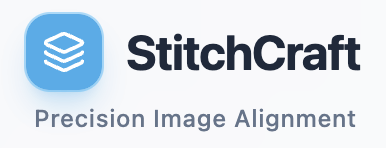
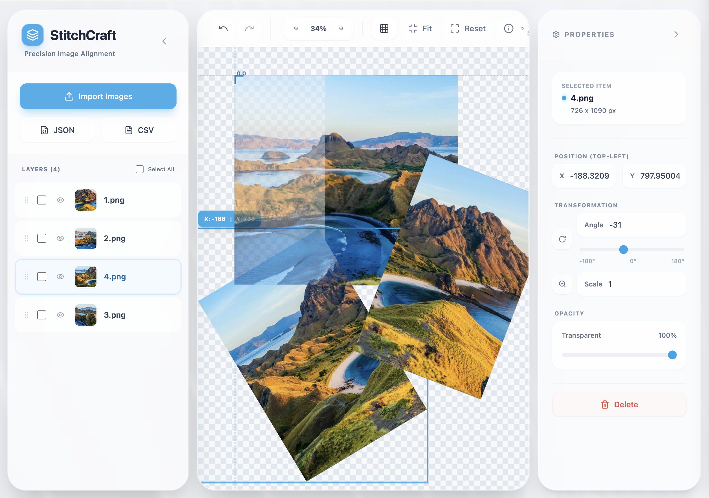

<div align="center">
  

  <p><strong>Precision Image Alignment</strong></p>

  [](https://react.dev/)
  [](https://www.typescriptlang.org/)
  [](https://vitejs.dev/)
  [](https://www.docker.com/)

  <p>A precision manual image stitching tool built with React and TypeScript.<br/>
  Upload multiple images, arrange them with drag-and-drop, adjust rotation and opacity,<br/>
  and export OpenCV-compatible coordinate data.</p>
</div>

---

## 📸 Preview

<div align="center">
  
</div>

## ✨ Features

- **🖼️ Multi-Image Upload** - Upload and manage multiple images simultaneously
- **🎯 Drag & Drop Interface** - Intuitively position images on the canvas
- **📚 Layer Management** - Organize images in layers with full control and reordering
- **⚙️ Precision Controls**
  - Adjustable rotation with visual feedback
  - Opacity control for perfect alignment
  - Scale/zoom capabilities
  - Fine-tuned coordinate positioning
- **📤 Export Functionality** - Export precise coordinate data (JSON/CSV) compatible with `cv2.warpAffine`
- **🎨 Modern UI** - Clean, responsive interface with frosted glass design
- **⌨️ Keyboard Shortcuts** - Undo/redo, delete, and navigation shortcuts
- **🔄 History System** - Full undo/redo support (up to 50 steps)

## 🚀 Quick Start

### Local Development

```bash
# Clone the repository
git clone <repository-url>
cd stitch-image

# Install dependencies
npm install

# Start development server
npm run dev
```

Open your browser and navigate to `http://localhost:3000`

### Docker Deployment

#### Using Makefile (Recommended)

```bash
# Development mode
make build          # Build dev Docker image
make run            # Run dev container (port 5173 → 3000)
make logs           # View container logs
make shell          # Access container shell
make stop           # Stop container

# Production mode
make build-prod     # Build production image
make run-prod       # Run production container (port 80)

# Utilities
make clean          # Remove containers and images
make rebuild        # Clean, rebuild, and run
make test           # Run type check
```

#### Using Docker Directly

```bash
# Development
docker build -t stitchcraft .
docker run -p 5173:3000 stitchcraft

# Production
docker build -t stitchcraft:prod --target production .
docker run -p 80:80 stitchcraft:prod
```

## 🛠️ Tech Stack

| Technology | Purpose |
|-----------|---------|
| **React 19** | UI framework with modern hooks |
| **TypeScript** | Type safety and better DX |
| **Vite** | Lightning-fast build tool and dev server |
| **Tailwind CSS** | Utility-first styling |
| **Lucide React** | Beautiful icon library |
| **Docker** | Containerized deployment |

## 📖 Usage Guide

1. **Import Images** - Click "Import Images" or drag files into the app
2. **Position Layers** - Drag images to arrange them on the canvas
3. **Adjust Transformations**
   - **Position**: Drag layers or use X/Y coordinate inputs
   - **Rotation**: Use the angle slider or input field
   - **Scale**: Adjust the scale multiplier
   - **Opacity**: Lower opacity to align overlapping images
4. **Layer Management**
   - Reorder layers by dragging in the layers panel
   - Toggle visibility with the eye icon
   - Select multiple layers (Shift/Ctrl+click)
   - Delete selected layers (Delete key)
5. **Canvas Controls**
   - **Pan**: Space + drag, middle-click drag, or Cmd/Ctrl + drag
   - **Zoom**: Mouse wheel or zoom buttons
   - **Fit to Screen**: Click "Fit" button
   - **Reset View**: Click "Reset" button
6. **Export Data** - Choose JSON or CSV format with OpenCV-compatible coordinates

## 🎮 Keyboard Shortcuts

| Shortcut | Action |
|----------|--------|
| `Space + Drag` | Pan canvas |
| `Ctrl/Cmd + Z` | Undo |
| `Ctrl/Cmd + Shift + Z` | Redo |
| `Ctrl/Cmd + Y` | Redo |
| `Delete` / `Backspace` | Delete selected layers |
| `Shift + Click` | Add to selection |
| `Ctrl/Cmd + Click` | Toggle selection |

## 📊 Export Format

### JSON Example
```json
[
  {
    "filename": "image1.png",
    "shift_x": 100,
    "shift_y": 200,
    "rotate": 15.5,
    "layer_order": 0
  }
]
```

### CSV Example
```csv
filename,shift_x,shift_y,rotate,layer_order
image1.png,100,200,15.5,0
```

### OpenCV Compatibility

The exported coordinates are compatible with Python OpenCV pipelines using `cv2.warpAffine`. The coordinate system matches OpenCV's behavior where:
- `shift_x`, `shift_y` refer to the top-left corner of the **rotated bounding box**
- `rotate` is in degrees (not radians)
- Rotation is applied around the image center
- Bounding box expands to fit the rotated image

See `CLAUDE.md` for detailed coordinate system documentation.

## 📁 Project Structure

```
stitch-image/
├── App.tsx              # Main application (1,538 lines - single-file React app)
├── index.tsx            # Application entry point
├── types.ts             # TypeScript type definitions
├── components/          # Reusable UI components
│   └── Icon.tsx         # Icon wrapper component
├── assets/              # Images and static files
├── index.html           # HTML template
├── package.json         # Dependencies and scripts
├── tsconfig.json        # TypeScript configuration
├── vite.config.ts       # Vite configuration (port 3000)
├── Dockerfile           # Multi-stage Docker build
├── Makefile             # Build automation
├── CLAUDE.md            # Development guide for Claude Code
└── README.md            # This file
```

## 🧪 Development

### Available Scripts

```bash
npm run dev          # Start dev server (port 3000)
npm run build        # Build for production
npm run preview      # Preview production build
npx tsc --noEmit     # Type checking only
```

### Development Features

- **Hot Module Replacement** - Instant updates during development
- **TypeScript** - Full type checking with strict mode
- **ESLint** - Code linting (if configured)
- **Frosted Glass UI** - Modern design with backdrop blur effects

### Making Changes

Before modifying coordinate calculations, review the `calculateRotatedDimensions()` function in `App.tsx`. All rotation math must match OpenCV's `cv2.warpAffine` behavior. See `CLAUDE.md` for architecture details.

## 📋 Prerequisites

### Local Development
- Node.js (v18 or higher)
- npm or yarn

### Docker Deployment
- Docker
- Make (optional, for simplified commands)

## 🐛 Known Issues

- README previously stated dev server runs on port 5173, but it actually runs on port 3000 (as configured in `vite.config.ts`)

## 📄 License

This project is private and not licensed for public use.


---

<div align="center">
  <p>Made with ❤️ using google-ai and claude code</p>
</div>
